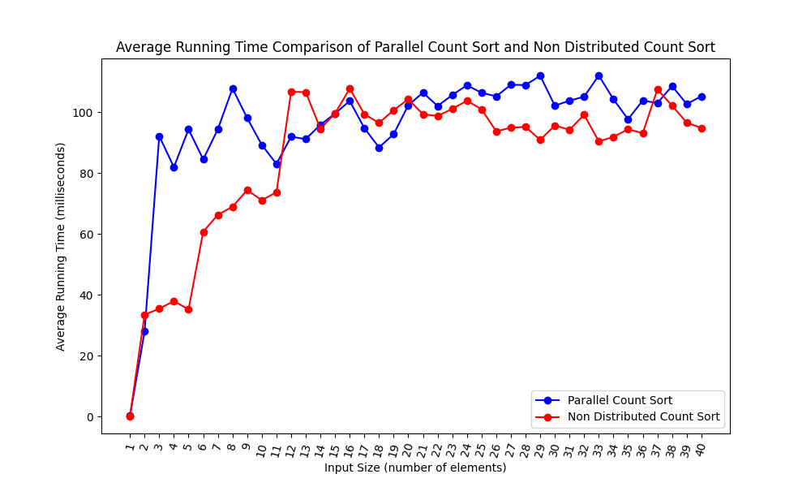
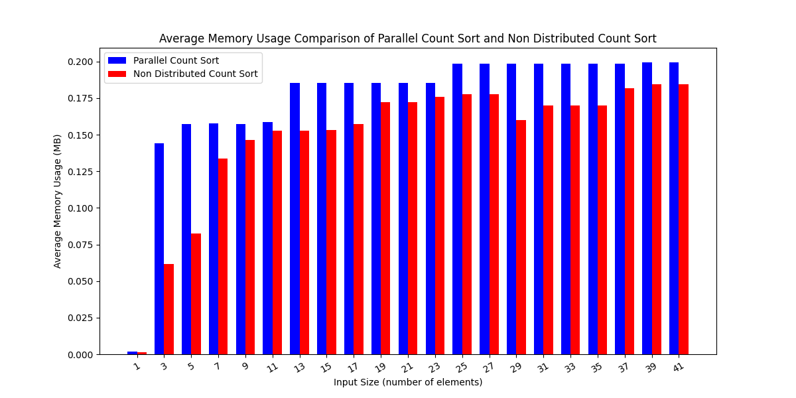
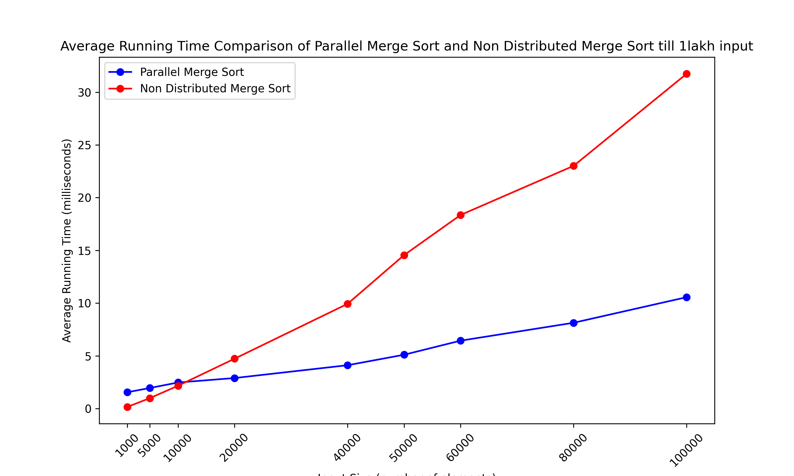
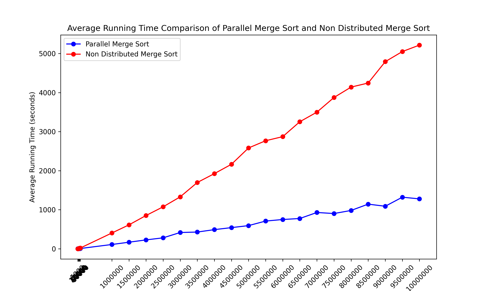
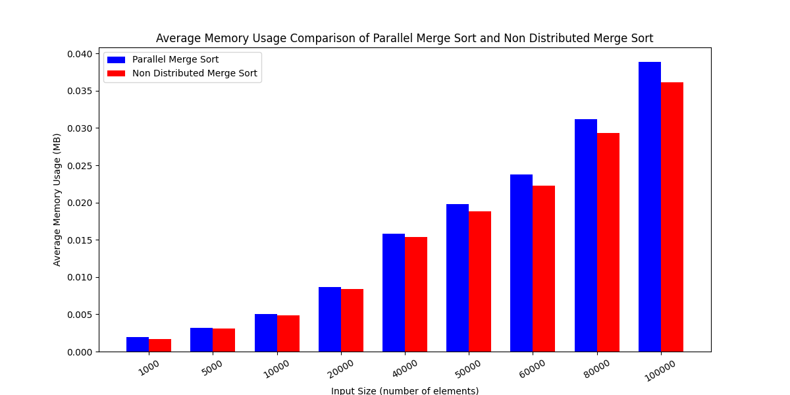
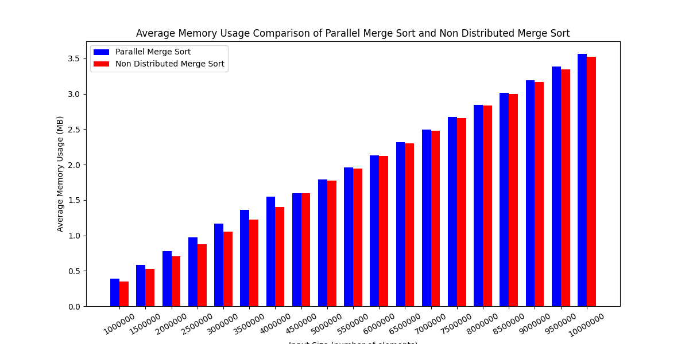
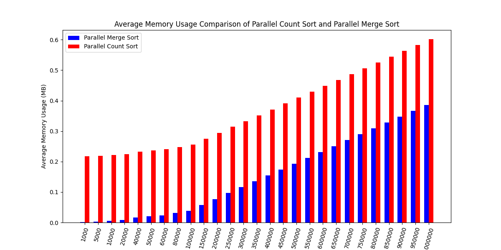

# concurrency

## Part B Parallel Sorts :

### Parallel Count Sort Implementation 

In case of number of files being less than 42 we are implementing parallel count sort .

Assumptions :-
    
1) Timestamps provided are within the range of 15 days so that the count array is within  5,00,000 size and performing it is feasible.

2) filenames are of the type file____.txt so after file a max a four characters from a - z or A - Z can appear where upper and lowercase will be treated as same. using this we can limit the count_array again to max of 4,56,976 and the count sort is feasible.

3) Ids are within a 100000 so that a feasible count_array can be made.

### Implementation Steps :-

1) first of all we are acquiring the minimum and maximum value of the given sorting_criteria value. for id i acquire minmum and maximum id and take there difference as the size of count array. For timestamp i take the index corresponding to the maximum and minimum timestamp and take there difference as the size of the count_array.For names also we acquire minimum index corresponding to a name and maximum index corresponding to a name and do the same thing.We have functions that return us indexes on feeding the value of timestamp and filenames.

2) After this we make a global count array of required size and a output files array of size total_files. Global count array is of structs where we have in each struct frequency and a linked list of file pointers which are present at that index.Along with this each struct also has its own lock which helps in avoiding race conditions that can be triggered in the presence of multiple threads.

3) now we divide the load into equal chunks for our threads and we have at max 8 threads. We run all of them in parallel and they fill the global count array.

4) after the global count array is completely filled we develop a new global count array that contains only those entries which were of non zero frequencies and for all of them we do a linear scan and convert there frequencies into prefix sums so that we can easily find there indexes in the final output array.

5) now we again divide the load of filling the output array among these 8 threads and give a portion of the global count array to each of the thread and this will thread executes a function called populate array that will be responsible for populating the final output array at the appropriate indexes.

6) finally the output is copied to files and itself freed. So we get the sorted output in files.

### Execution time analysis



### Memory usage Analysis




### Parallel Merge Sort Implementation :-

  ### Implementation Steps 

  1) In case of parallel merge sort we have divided our intial array into 2 chunks initially passing both of them to seperate threads and merge sort is being applied on them.
  2) so for level 0 merge sort we made two threads and these parallely perform merge sort. Now we will do the same thing in both the threads too and continue doing this upto 5 levels i.e. the at the end there will be 32 leaf threads.
  3) inside this leaf threads we can perform qsort or mergesort (non distributed) and we found out that qsort performs better so current implementation involves qsort.
  4)  After this we all the upper level threads will parallely merge there children and finally we get the sorted array at the top.

### Execution time analysis






### Memory usage Analysis





### Memory usage analysis between distributed count and merge sort



## COPY-ON-WRITE FORK 

    Copy on write fork allows us to increase efficiency as now forking a new process will not immediately copy all of the parent process's pages but will copy pages only when required.

    In order to implement copy on write fork we have made changes majorly in 3 files namely kalloc.c , trap.c and vm.c .

    Idea -> while forking a new process a function uvmcopy is called which is responsible for copying all of the parent process's page to this new process and fill the new process's page table with the entries of these pages.
    Now instead of creating new pages we will make the page table entries of the new process point to the same process but there's twist , we will mark these pages as read only ( if they were writable ) and will mark them cow pages using the new PTE_COW flag which we have defined in defs.h . All this will be done only for writable pages as during trap handling copies of only writeable pages are required .For readonly pages we will not make them cow pages as we do not need to handle them ever because the process should never be able to write on them and so we can never turn them into writeable.
    So instead of creating new pages for the process we referenced the old pages.We also maintain an array called reference_counter of size of number of physical pages that can be accomodated in the memory and we initially set reference count of all pages to 0. This is done in free range function. This reference counter array is to check how many processes are currently refering to a single page.
    So now whenever a fork is called ptes of child are filled with references and reference counter is incremented. Whenever any of the process referencing to a page wants to write on it , it leads to a page fault exception(r_scause() == 15).
    Now we handle this in usertrap and check whether the page the user is trying to write on is COW page or not because if it is not a cow page then it may be an invalid page or it may be a readonly page and then process needs to be killed however if it is cow page then we just make a copy of it with appropriate flags (make it writeable and non cow page )  , and reduce the reference count of the current page as now this process will reference to another page. 

### IMPLEMENTATION :-
#### In order to implement cow fork we made following changes :-
#### 1) changes in vm.c :- 
    a) in uvmcopy we iterate over all the pages of the parent process and make the child point to the same pages after setting flags for writeable pages to readonly and cow pages. Also we increment the reference counter for this page.
    b) in copyout we check whether the page is cow page or not .... if yes then we make a new copy of the page with appropriate flag and make  the process point to that new page and we free the old page ( note that freeing means decrementing reference count and if reference count becomes 0 then we remove the page) .
#### 2) changes made in kalloc.c :-
    a) in kfree i.e. whenever freeing a page we first check the reference count of the page .. if the reference count of the page is greater than one then we can just decrease the count however if the reference count is 1 then we will actually remove the page.
    b) Whenever a page is allocated using kalloc we make the reference count of that 1 as one process (the process asking for a page) is refering to the page.
#### 3) changes made in trap.c :-
    a) whenever page fault occurs because we have made the page write only we need to create a copy of the page with write permission and give it to the process trying to write on the page.if only a single refernce is being made to the page then we can just change the permissions for that page. page fault corresponds to r_scause() = 15 so we have added our logic inside else if(r_scause() == 15 );


### Analysis


```$ lazytest
simple: Process 4 had 0 page faults
ok
simple: Process 5 had 0 page faults
ok
three: Process 6 had 4096 page faults
Process 7 had 6554 page faults
ok
three: Process 8 had 4096 page faults
Process 9 had 6554 page faults
ok
three: Process 10 had 4096 page faults
Process 11 had 6554 page faults
ok
file: Process 12 had 0 page faults
Process 13 had 0 page faults
Process 14 had 0 page faults
Process 15 had 0 page faults
ok
ALL COW TESTS PASSED
Process 3 had 24588 page faults
$ testReadOnly
simple: Process 17 had 0 page faults
ok
Process 16 had 3 page faults
$ testModifyMemory
simple: Process 20 had 1 page faults
ok
Process 19 had 3 page faults
$ 
```

## Discuss the benefits of COW fork in terms of efficiency and memory conservation

Memory Efficiency:

Traditionally, fork() creates a full duplicate of the parent process's memory space for the child process, which can be resource-intensive if the child doesn’t modify most of this memory.

With COW (Copy-on-Write) fork, the memory footprint is minimized by allowing the parent and child processes to initially share the same physical memory pages. Instead of duplicating memory immediately, the operating system marks pages as read-only and uses reference counting. If either process attempts to write to a shared page, a new copy of that page is created only then.

This method leads to significant memory savings, especially for processes with large memory footprints or those that primarily read from memory rather than modifying it.

Improved Performance:

Since COW fork skips the immediate copying of memory pages, it’s much faster than traditional fork for processes that may not need to write to their memory space right away.

This approach is particularly advantageous in cases where a process uses fork() to create a child process that will immediately execute a different program using exec(). In such cases, the child process doesn’t require the memory space of the parent, so duplicating it would be wasteful.

Additionally, COW reduces page faults and cache misses, improving CPU cache utilization.

Potential Optimizations for COW:

Page Sharing Granularity: COW operates at the page level, which means even if only a small portion of a page is modified, an entire new page is allocated. Introducing sub-page-level COW could potentially save memory further, although it would involve more complex management and may impact performance.

Delayed Copy-on-Write: Deferred page allocation could be another enhancement, where instead of allocating a new page on the first write, the system waits to see if multiple writes occur. This could reduce page faults for workloads that involve bursty writes.
